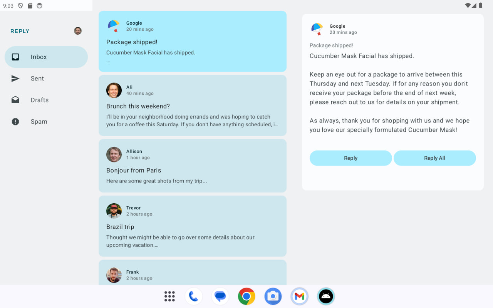
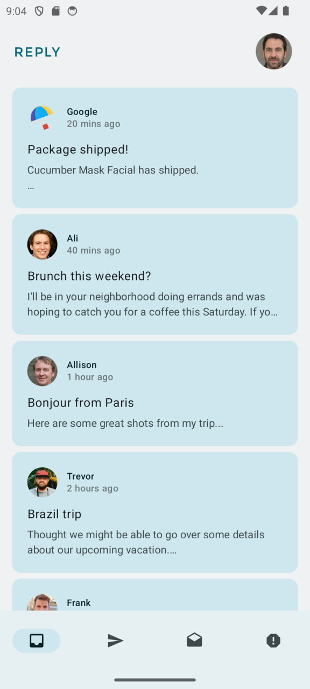
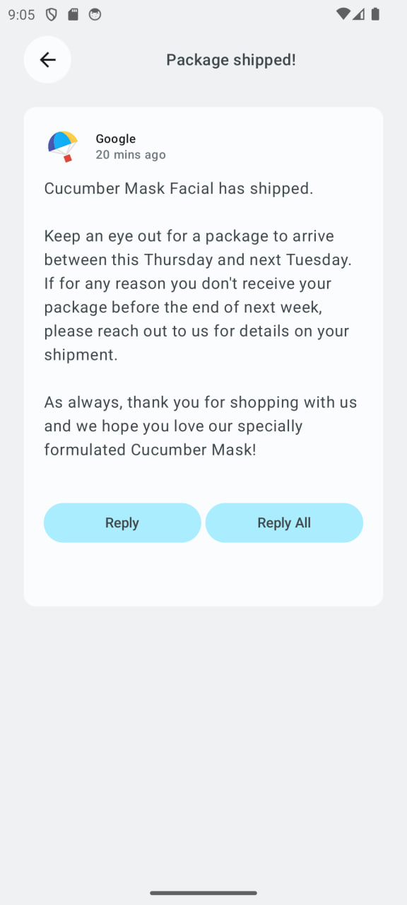

Reply App - Starter Code
=================================
Starter code for the Android Basics with Compose: Reply app.

Introduction
------------
The Reply app is a basic email client that displays various categories of your
inbox. This app is used to illustrate the concept of adaptive layouts.

Pre-requisites
--------------

* Experience with Kotlin syntax
* How to create and run a project in Android Studio
* How to create composable functions
* How to create compose navigation

Features
--------------

- **Responsive Design:** The app adapts to different screen sizes, providing a seamless experience on compact, medium, and expanded displays.
- **Navigation Options:** Depending on the screen size, the app uses different navigation strategies:
    - **Bottom Navigation** for compact devices.
    - **Navigation Rail** for medium-sized devices.
    - **Permanent Navigation Drawer** for expanded displays.
- **Email Management:** Users can view a list of emails, select an email to view details, and navigate back to the list.
- **State Restoration:** The app retains the selected email details even after configuration changes (like screen rotation), ensuring a smooth user experience.

ScreenShots
-------------

Getting Started
---------------

1. Install Android Studio, if you don't already have it.
2. Download the sample.
3. Import the sample into Android Studio.
4. Build and run the sample.

Testing
---------------
- The app includes UI tests to ensure that different navigation options are functioning correctly based on the window size. The following tests are implemented:

1. **Navigation Tests:**
Verify the correct navigation component is displayed on different screen sizes (Compact, Medium, Expanded).

2. **State Restoration Tests:**
Ensure that the selected email details persist after configuration changes.